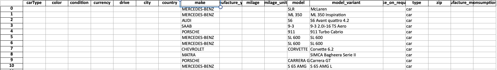

# Onedot Test

## Current State
Due to a busy schedule this week, I couldn't give myself much time to complete the tasks within the alloted timeframe. I believe I have currently completed **Task 1.) Pre-processing**.
As I have not worked with Java in a docker environment or Spark before I had a bit of a learning curve in order to make progress with this challenge. I added the Dockerfile I was attempting to build from which currently is stuck on a bug in the java install section:
```
E: Sub-process /usr/bin/dpkg returned an error code (1)
```
I assume it has something to do with the ppa step but I don't yet know enough about java installation to solve this yet and ran out of time. So sadly this app isn't run in an isolated environment. I will write below what I did and my thought process before talking about how I might have continued.

## How to run the project
As I am yet to get the Dockerfile working, This process requires the following dependancies:
1.) Spark installed
2.) A Python virtual environment set-up
3.) pip installed within the environment

First, install the required python packages:
```
pip install -r requirements.txt
```
Now you can run the pipeline. From root, run:
```
python src/pyspark_pipeline.py
```
Once run, You should get confirmation in the terminal that the dataframe has successfully written to an Excel file.
The output file can be found in **src/output_data/target_data.xlsx*

### Task 1.) Pre-processing
*"Here you need to load the data into a dataset and transform the supplier data to achieve the same granularity as the target data."*

My first step was to do a crash course for Spark and Pyspark. I watched a number of Youtube videos about what Spark is both within the Hadoop ecosystem and as a stand-alone and how to interact with Spark using Python. Once I had an idea of how I wanted to start, I started writing my code in 'pyspark_pipeline.py'

I first wanted to see if I could move the data from a json to a xlsx file. I began by reading the json file into spark, running a sql command:
```
SELECT *
FROM supplier_car
LIMIT 10
```
in order to test the data without loading the whole thing. One bug I had to fix during this was turning the Spark dataframe into an excel file. I realised that the best way forward was to convert the Spark dataframe into a Pandas dataframe.
Once I got this working, I could focus on making the data fit the target_data.xlsx sheet format:
```
SELECT 
                ''          AS carType,
                ''          AS color,
                ''          AS condition,
                ''          AS currency,
                ''          AS drive,
                ''          AS city,
                ''          AS country,
                MakeText    AS make,
                ''          AS manufacture_year,
                ''          AS milage,
                ''          AS milage_unit,
                ModelText   AS model,
                TypeName    AS model_variant,
                ''          AS price_on_request,
                'car'       AS type,
                ''          AS zip,
                ''          AS manufacture_month,
                ''          AS fuel_consumption_unit
            FROM 
                supplier_car
```
At this step I am missing a lot of the data. Not knowing what SQL syntax I could use in order to set datatypes to each column (or if that should be happening at this stage) I decided to include the columns without data as empty strings.
target_data.xlsx output the data as such:

I ran out of time before I could find out how to make sure the data was encoded as UTF-8.

### How I would have continued
I would have probably done the transformations in Pandas as it is a framework I am comfortable with for **Tasks 2 to 4**. Each Task would be in an isolated file and I would have seen if there was anything I could have done to set the previous Tasks as dependancies for the next Task to run in order to make sure that bugs in the data would halt the pipeline rather than load incompatable data.

## Conclusion
I have wanted to learn how to use Spark for a long time now but haven't had any practical reason to start. I am aware that as Spark is written in Scala, Scala is a faster alternative to Python and I have now bought a Scala course on Udemy as I would love to be able to work with Spark properly. Sadly a combination of a lack of time (My current project is coming to an end and has taken a lot of my time) and inexperience with the desired technology stalled my progress but I enjoyed the chance to learn with new frameworks and will be using this as a baseline for future learning.
